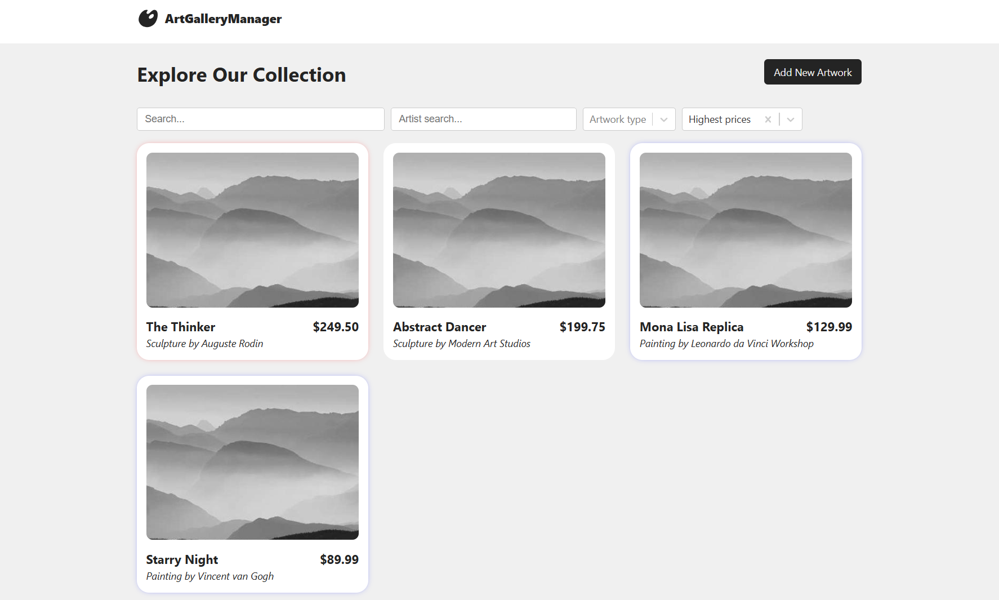
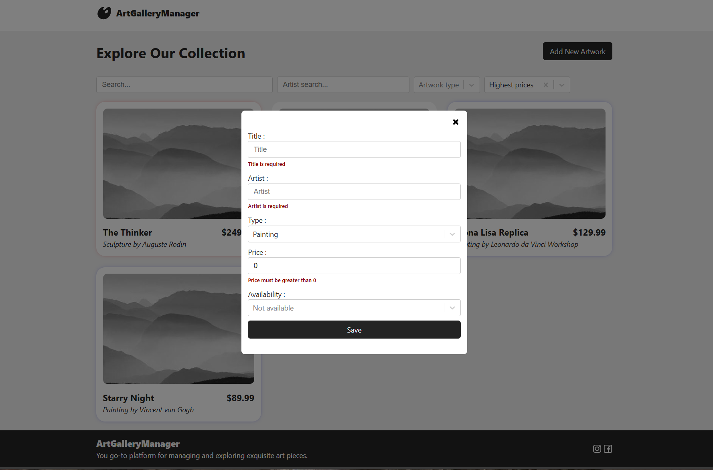
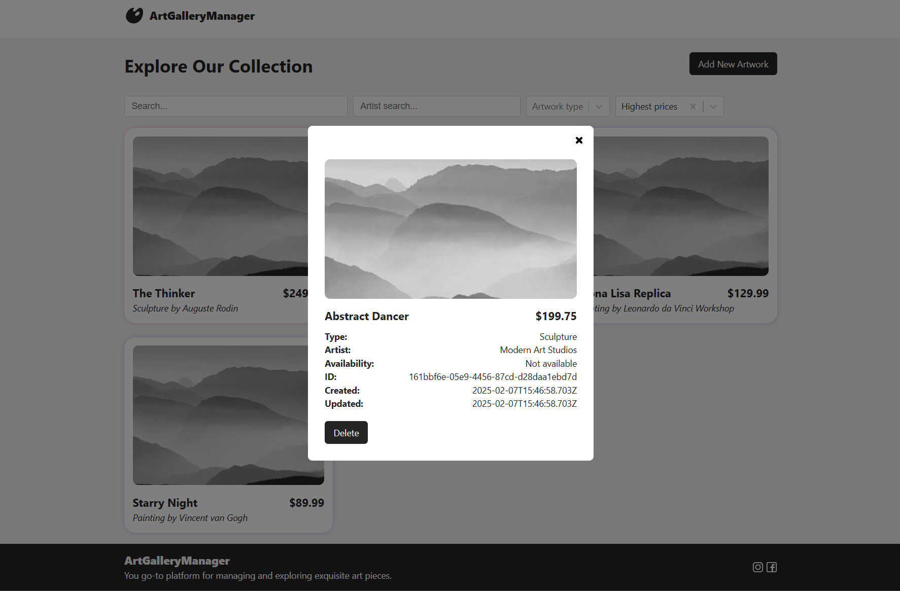

# ArtGalleryManager

This web application enables gallery administrators to manage and display art pieces in
a virtual gallery. Users can view, filter, and sort through artwork, while gallery admins
have control over listings, with the ability to add new artwork or remove existing pieces.

#### Application Overview:

Monorepo. The application consists of two primary parts: a backend (Web API) and a frontend
(SPA).

## Tech Stack

**Client:** Typescript, React, Redux, ReactRouter, ReactHookForm

**Server:** Typescript, Node.js, Express, TypeOrm, Postgresql

## Installation

Install the project

```bash
  git clone https://github.com/perekotypole/art-gallery.git
```

### Manual installation:

#### Requirements:

- NodeJS (>= 20.x.x);
- npm (>= 10.x.x);
- PostgreSQL (>= 16.4)

1. Run instalation:

  ```bash
    npm i
  ```

2. Build shared module:

  ```bash
    npm run build:shared
  ```

3. Create database `artgallery` and do migrations:

  ```bash
    npm run migrate
  ```

  *If you need to revert migrations:* `npm run migrate:revert`

4. In forders `apps/client` and `apps/server` make a copies of inner `.env.example` files, rename them to `.env` and leave them or rewrite to your data.

5. Run:

  -  Run server in dev mode: `npm run start:server`
  -  Run client in dev mode: `npm run start:client`

##### *Dev mode:*
  -  Run server in dev mode: `npm run dev:server`
  -  Run client in dev mode: `npm run dev:client`


## Screenshots

#### Route: `/`



#### Route: `/new`



#### Route: `/details/{artworkId}`



## API Reference

#### Get all artworks

```http
  GET /artworks
```

| Parameter | Type                        | Description                      |
| :-------- | :-------------------------- | :------------------------------- |
| `price`   | `"asc" \| "desc"`           | _Not required_. Sort by price    |
| `title`   | `string`                    | _Not required_. Search by title  |
| `artist`  | `string`                    | _Not required_. Search by artist |
| `type`    | `"painting" \| "sculpture"` | _Not required_. Filter by type   |

#### Get artwork

```http
  GET /artworks/${id}
```

#### Create artwork

```http
  POST /artworks
```

| Parameter      | Type                        | Description                          |
| :------------- | :-------------------------- | :----------------------------------- |
| `title`        | `string`                    | **Required**. Artwork name           |
| `artist`       | `string`                    | **Required**. Artist name            |
| `type`         | `"painting" \| "sculpture"` | **Required**. Artwork type           |
| `price`        | `number`                    | **Required**. Artwork price          |
| `availability` | `boolean`                   | _Not required_. Artwork availability |

#### Remove artwork

```http
  DELETE /artworks/${id}
```

#### Update artwork data

```http
  POST /artworks/${id}
```

| Parameter      | Type                        | Description                          |
| :------------- | :-------------------------- | :----------------------------------- |
| `title`        | `string`                    | **Required**. Artwork name           |
| `artist`       | `string`                    | **Required**. Artist name            |
| `type`         | `"painting" \| "sculpture"` | **Required**. Artwork type           |
| `price`        | `number`                    | **Required**. Artwork price          |
| `availability` | `boolean`                   | _Not required_. Artwork availability |
